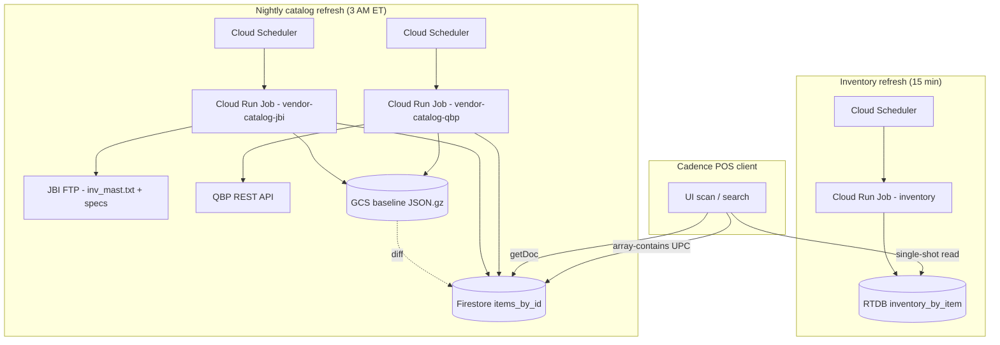
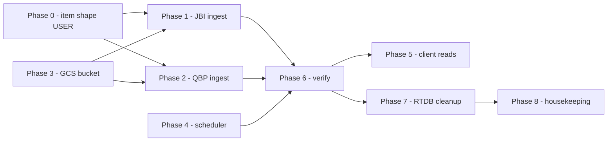

# Vendor Catalog → Firestore Migration Plan

Hybrid migration: move **items master + specs** from RTDB to Firestore, keep **inventory counts** in RTDB. Eliminates the `items_by_upc` reverse-index node in favor of Firestore `array-contains` queries. Catalog refresh becomes a nightly Cloud Storage baseline-diff job per vendor.

---

## Locked decisions

| Concern | Decision |
|---|---|
| Items master location | Firestore: `vendor_catalogs/{vendor}/items_by_id/{itemId}` |
| Inventory counts location | RTDB: `vendor_catalogs/{vendor}/inventory_by_item/{itemId}` |
| Specs | Folded into Firestore item doc (no separate node) |
| UPC reverse index | **Eliminated.** Use Firestore `where("allUpcs", "array-contains", upc)` |
| Live subscriptions | **Forbidden** on any `vendor_catalogs/*` path. Point-lookups + bounded queries only. |
| Items refresh cadence | Nightly, 3:00 / 3:30 AM ET (staggered per vendor) |
| Inventory refresh cadence | Every 15 min, 6 AM ET to 10 PM PT (19-hour window) |
| Items diff strategy | Cloud Storage baseline JSON (gzipped) → in-memory diff → write changes only |
| Baseline bucket | `gs://cadence-pos-vendor-catalog-baselines/` |
| Bootstrap behavior | First run with no baseline = treat every row as an add, then upload baseline |
| Failure semantics | New baseline uploaded **only after** Firestore writes complete; partial failure re-diffs cleanly next run |
| GCP project | `cadence-pos` |
| Deploy account | `fritz@retailsoftsystems.com` |

---

## Architecture



---

## Cost summary at locked cadence

```metrics
Inventory job (RTDB, 15-min, 19hr) | $7.00/mo | -- | 82 | warning
Items diff (Firestore, nightly, both) | $1.45/mo | -- | 17 | info
GCS baseline storage | ~$0.05/mo | negligible | 1 | success
Total | $8.50/mo | -- | 100 | info
```

---

## File layout

### Baseline bucket

```tree
gs://cadence-pos-vendor-catalog-baselines/
├── jbi-items.json.gz       # canonical item map: { [itemId]: CanonicalItem, ... }
└── qbp-items.json.gz       # same shape
```

### Jobs repo (after migration)

```tree
jobs/
├── vendor-catalog-jbi/
│   ├── index.js                    # mode dispatcher (master | inventory | specs | count)
│   ├── modes/
│   │   ├── master.js               # REWRITE: was RTDB, now Firestore-diff
│   │   ├── inventory.js            # UNCHANGED (stays RTDB)
│   │   ├── specs.js                # REMOVED (folded into master)
│   │   └── count.js                # UNCHANGED
│   ├── ftp.js, parser.js, meta.js  # UNCHANGED
│   ├── rtdb.js                     # UNCHANGED (inventory only now)
│   ├── firestore.js                # NEW: admin SDK init + batched writer
│   └── baseline.js                 # NEW: GCS download/upload + diff helper
└── vendor-catalog-qbp/
    ├── (mirror of above, no specs.js)
    └── ...
```

---

## Phase 0 — Item object shape (USER TODO, blocks all below)

You will examine sample payloads from both vendors and define:

1. **Master item shape** — fields the canonical doc carries.
2. **JBI → master mapping** — `inv_mast.txt` row → master.
3. **QBP → master mapping** — `/1/product/sku/{sku}` response → master.
4. **Specs folding** — JBI's 20 title/value pairs → final shape on the master doc (array of `{title, value}` vs flattened object).

Current working shape (placeholder, will be replaced):

```js
// TODO: USER LOCKS THIS BEFORE PHASE 1
const CanonicalItem = {
  id: "",            // string — RTDB/Firestore doc key
  name: "",          // string
  brand: "",         // string
  cost: 0,           // cents
  msrp: 0,           // cents
  primaryUpc: "",    // string
  allUpcs: [],       // string[]  ← Firestore array-contains target
  specs: [],         // { title, value }[]  (JBI only for now)
  vendor: "",        // "jbi" | "qbp"  ← stored on doc for cross-vendor queries
  updatedAt: 0,      // ms epoch — set on every write
};
```

**Output of Phase 0:** finalized shape + 2 mapping functions documented inline above each job's `master.js`.

---

## Phase 1 — JBI Firestore ingest mode

**File:** `jobs/vendor-catalog-jbi/modes/master.js` (rewrite)

**Inputs:**
- `inv_mast.txt` from FTP (with existing modtime skip)
- `product_spec_with_titles.txt` from FTP (specs, fold inline)
- Current baseline from `gs://cadence-pos-vendor-catalog-baselines/jbi-items.json.gz`

**Algorithm:**

```timeline
title: JBI master.js flow
[x] FTP modtime check — skip if unchanged | existing logic, keep as-is
[ ] Download baseline | gsutil API, gunzip into memory; empty map if 404 (bootstrap)
[ ] Stream inv_mast.txt + specs.txt | tab parser, build current map keyed by itemId
[ ] Map JBI row -> CanonicalItem | Phase 0 mapping fn; fold specs by itemId join
[ ] In-memory diff vs baseline | adds[], changes[], deletes[]; deep-equal compare
[ ] Write Firestore in batches | 500/commit; set(merge: true) on adds+changes; delete() on deletes
[ ] Upload new baseline to GCS | gzipped JSON; only after all writes succeed
[ ] Write meta to RTDB | itemCount, addCount, changeCount, deleteCount, durationSec
```

**Helpers:**
- `jobs/vendor-catalog-jbi/firestore.js` — admin SDK init, batched writer (auto-flush at 500), retry on `RESOURCE_EXHAUSTED`.
- `jobs/vendor-catalog-jbi/baseline.js` — `loadBaseline(vendor)` and `uploadBaseline(vendor, map)`. Gzip on upload, gunzip on download. Returns `{}` on 404.

**Specs join:** stream `product_spec_with_titles.txt` first into `specsByItemId: Map<itemId, [{title, value}, ...]>`, then attach when mapping each `inv_mast.txt` row. Drop `modes/specs.js` entirely after this lands.

**Mode dispatch:** `index.js` keeps `master` and `inventory`; remove `specs` from valid modes.

---

## Phase 2 — QBP Firestore ingest mode

**File:** `jobs/vendor-catalog-qbp/modes/master.js` (rewrite)

Mirrors Phase 1 with QBP-specific bits:
- Replace FTP parsing with existing `/1/product/skulist` + `/1/product/sku/{sku}` REST calls (~25 min full fetch).
- Keep the existing response-hash skip on `skulist` — full per-SKU fetch only when list changes.
- No specs fold (QBP has none in scope; revisit when QBP specs taxonomy is in).
- Same baseline + diff + Firestore write pipeline.

**Helpers shared with JBI:**
- `firestore.js` and `baseline.js` can be near-copies between vendors, or extracted to a shared package. **Default: copy.** Two vendor jobs is not enough to justify a shared module; extracting now is premature abstraction.

---

## Phase 3 — GCS bucket + IAM

**Bucket:** `cadence-pos-vendor-catalog-baselines`

```
gsutil mb -p cadence-pos -l us-central1 gs://cadence-pos-vendor-catalog-baselines
gsutil lifecycle set lifecycle.json gs://cadence-pos-vendor-catalog-baselines
```

`lifecycle.json` (optional — keeps last 30 days of versioned baselines for rollback):

```json
{
  "lifecycle": {
    "rule": [
      { "action": { "type": "Delete" }, "condition": { "age": 30, "isLive": false } }
    ]
  }
}
```

Enable versioning:

```
gsutil versioning set on gs://cadence-pos-vendor-catalog-baselines
```

**IAM:** Cloud Run Jobs service account needs `roles/storage.objectAdmin` scoped to the bucket. Inventory job needs nothing new; existing RTDB perms remain.

---

## Phase 4 — Cloud Scheduler entries

Two new nightly jobs; existing 15-min inventory scheduler unchanged.

```
gcloud scheduler jobs create http vendor-catalog-jbi-master \
  --schedule="0 3 * * *" \
  --time-zone="America/New_York" \
  --uri="<Cloud Run Job exec URL>" \
  --http-method=POST \
  --oauth-service-account-email=<SA> \
  --location=us-central1 \
  --project=cadence-pos --account=fritz@retailsoftsystems.com
```

```
gcloud scheduler jobs create http vendor-catalog-qbp-master \
  --schedule="30 3 * * *" \
  --time-zone="America/New_York" \
  --uri="<Cloud Run Job exec URL>" \
  --http-method=POST \
  --oauth-service-account-email=<SA> \
  --location=us-central1 \
  --project=cadence-pos --account=fritz@retailsoftsystems.com
```

Then verify `platformAdminSyncScheduledJobsCallable` picks them up (basename match against `functions/saas/vendor-catalog-jobs.js`).

---

## Phase 5 — Client read helpers

**File:** `src/db_calls_wrapper.js` (add)

```js
// Single item by ID (point lookup)
async function dbGetVendorItemByID(vendor, itemId) {
  return await firestoreReadDoc(`vendor_catalogs/${vendor}/items_by_id/${itemId}`);
}

// Lookup by UPC across all items_by_id for vendor (array-contains)
async function dbGetVendorItemByUPC(vendor, upc) {
  const results = await firestoreReadQuery(
    `vendor_catalogs/${vendor}/items_by_id`,
    [["allUpcs", "array-contains", upc]],
    1
  );
  return results[0] || null;
}

// Inventory single-shot read (RTDB)
async function dbGetVendorInventoryByItem(vendor, itemId) {
  return await rdbCatalogRead(`vendor_catalogs/${vendor}/inventory_by_item/${itemId}`);
}
```

> [!CAUTION]
> No `onSnapshot()` / `onValue()` on any vendor_catalogs path. Hard rule. If a screen needs reactivity (price-alert UX, restock notification), a Cloud Function trigger pushes to a tenant-scoped node that the screen listens to.

**Existing references to update:**
- Chrome extension callable `addJBIItemToVendorOrder` in `functions/saas/chrome-extension-callables.js` — switch from `rdbCatalogRead("vendor_catalogs/jbi/items_by_id/...")` to Firestore via admin SDK.
- Any other server-side lookup that hits the items node (grep for `vendor_catalogs/.*items_by_id` and `vendor_catalogs/.*items_by_upc`).

---

## Phase 6 — First run + verification

> [!CAUTION]
> **Bootstrap gated on Phase 0.** Do NOT manually invoke or let the scheduler fire until the canonical shape + real JBI/QBP mapping functions are locked. Phases 1–2 code can land with stub mappings, but the first Firestore write must use the final shape — otherwise the next nightly run rewrites every doc to re-baseline against the real shape (a wasted ~$0.30 catalog churn event).

1. Deploy the new Cloud Run Job revisions for both vendors.
2. Manually invoke each (don't wait for scheduler) — first run is bootstrap with no baseline.
3. Verify Firestore: ~150k JBI items, ~Nk QBP items written.
4. Verify GCS: `jbi-items.json.gz` and `qbp-items.json.gz` present, sized roughly proportionally.
5. Spot-check 10 random items per vendor — open Firestore console, compare fields against source (FTP file row / QBP API response).
6. Run a UPC lookup query in the Firestore console: `where allUpcs array-contains "<known-UPC>"`. Confirm single doc returned.
7. Let the scheduler take over next night. Confirm diff math: `addCount + changeCount + deleteCount` matches actual catalog churn (likely <50 total).

---

## Phase 7 — RTDB cleanup

After 2 successful nightly runs + a week of client reads against Firestore working clean:

```
firebase database:remove /vendor_catalogs/jbi/items_by_id --project=cadence-pos --account=fritz@retailsoftsystems.com
firebase database:remove /vendor_catalogs/jbi/items_by_upc --project=cadence-pos --account=fritz@retailsoftsystems.com
firebase database:remove /vendor_catalogs/jbi/specs --project=cadence-pos --account=fritz@retailsoftsystems.com
firebase database:remove /vendor_catalogs/qbp/items_by_id --project=cadence-pos --account=fritz@retailsoftsystems.com
firebase database:remove /vendor_catalogs/qbp/items_by_upc --project=cadence-pos --account=fritz@retailsoftsystems.com
```

`vendor_catalogs/{vendor}/inventory_by_item` stays in RTDB.

Update `database.rules.json` if `vendor_catalogs` paths get tighter (currently `.read: true`, `.write: false` — works for the slimmed-down inventory-only tree).

---

## Phase 8 — Housekeeping

- Fix JBI inventory key naming: `avail_pa` → `PA` in `jobs/vendor-catalog-jbi/modes/inventory.js`. Cheap to do now (no readers yet).
- Confirm QBP inventory writes use clean warehouse codes as keys.
- Update memory file `project-vendor-catalog-rtdb-migration.md` — reflect that items + specs moved to Firestore; only inventory stayed in RTDB.
- Update memory file `project-vendor-catalog-no-listeners.md` — no change needed (rule still applies, just to Firestore now).

---

## Deploy commands (for reference)

Cloud Run Job rebuild + redeploy (per vendor):

```
gcloud builds submit jobs/vendor-catalog-jbi \
  --tag=us-central1-docker.pkg.dev/cadence-pos/cloud-run-source-deploy/vendor-catalog-jbi:latest \
  --project=cadence-pos --account=fritz@retailsoftsystems.com
```

```
gcloud run jobs update vendor-catalog-jbi \
  --image=us-central1-docker.pkg.dev/cadence-pos/cloud-run-source-deploy/vendor-catalog-jbi:latest \
  --region=us-central1 \
  --project=cadence-pos --account=fritz@retailsoftsystems.com
```

Manual trigger:

```
gcloud run jobs execute vendor-catalog-jbi --region=us-central1 --project=cadence-pos --account=fritz@retailsoftsystems.com
```

(Same shape with `qbp` swapped in.)

---

## Phase dependency graph



Phases 3 and 4 (infra) can run in parallel with Phase 0 (item shape). Phases 1 and 2 are independent and can be done in either order, or together.
